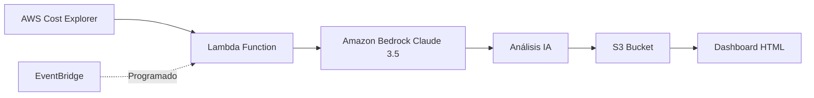

# 💰 AWS Cost Optimizer AI

> Herramienta inteligente de análisis y optimización de costes AWS usando Amazon Bedrock

[](https://www.python.org/downloads/)
[](https://aws.amazon.com/)
[](LICENSE)

## 🎯 ¿Qué hace este proyecto?

**AWS Cost Optimizer AI** analiza automáticamente tus costes de AWS y genera recomendaciones inteligentes de optimización usando IA generativa (Amazon Bedrock con Claude 3.5).

### Características principales

✅ **Análisis automático** de costes usando AWS Cost Explorer API  
✅ **IA generativa** (Amazon Bedrock - Claude 3.5) para recomendaciones personalizadas  
✅ **Dashboard visual** interactivo con gráficos de costes  
✅ **Modo demo** con datos de ejemplo (no requiere cuenta AWS)  
✅ **Arquitectura serverless** lista para producción  
✅ **Recomendaciones concretas**: rightsizing, Savings Plans, recursos huérfanos, etc.

---

## 🏗️ Arquitectura



**Flujo de trabajo:**
1. Lambda obtiene datos de costes de Cost Explorer (o usa datos mock)
2. Envía el informe a Amazon Bedrock (Claude 3.5 Sonnet)
3. La IA analiza patrones y genera recomendaciones
4. Resultados se guardan en S3 y se visualizan en dashboard

---

## 🚀 Inicio rápido

### Requisitos previos

- Python 3.11+
- Cuenta AWS (opcional para modo demo)
- AWS CLI configurado (opcional)

### Instalación

```bash
# Clonar el repositorio
git clone https://github.com/tu-usuario/aws-cost-optimizer-ai.git
cd aws-cost-optimizer-ai

# Crear entorno virtual
python3 -m venv venv
source venv/bin/activate  # En Windows: venv\Scripts\activate

# Instalar dependencias
pip install -r requirements.txt

# Configurar variables de entorno (opcional para AWS real)
cp .env.example .env
# Editar .env con tus credenciales si usas AWS real
```

### Uso en modo DEMO (sin AWS)

```bash
# Ejecutar análisis con datos de ejemplo
python src/main.py --demo

# Generar dashboard
python src/dashboard.py

# Abrir dashboard en navegador
open templates/dashboard.html
```

### Uso con AWS real

```bash
# Configurar credenciales AWS
export AWS_PROFILE=tu-perfil
export AWS_REGION=us-east-1

# Ejecutar análisis real
python src/main.py --days 30

# Generar dashboard con datos reales
python src/dashboard.py
```

---

## 📁 Estructura del proyecto

```
aws-cost-optimizer-ai/
├── README.md                    # Este archivo
├── LICENSE                      # Licencia MIT
├── requirements.txt             # Dependencias Python
├── .env.example                 # Plantilla de variables de entorno
├── docs/
│   └── architecture.md          # Documentación de arquitectura
├── src/
│   ├── main.py                  # Punto de entrada principal
│   ├── cost_analyzer.py         # Obtención de datos de Cost Explorer
│   ├── bedrock_analyzer.py      # Integración con Amazon Bedrock
│   ├── recommendations.py       # Lógica de recomendaciones
│   └── dashboard.py             # Generación de dashboard
├── data/
│   └── sample_cost_data.json    # Datos de ejemplo para demo
├── templates/
│   └── dashboard.html           # Dashboard HTML interactivo
├── terraform/
│   ├── main.tf                  # Infraestructura como código
│   ├── variables.tf             # Variables Terraform
│   └── outputs.tf               # Outputs Terraform
└── .github/
    └── workflows/
        └── ci-cd.yml            # Pipeline CI/CD
```

---

## 🎨 Dashboard

El dashboard muestra:

- 📊 **Gráfico de costes por servicio** (últimos 30 días)
- 💡 **Top 5 recomendaciones** priorizadas por ahorro potencial
- 💰 **Ahorro estimado total** en USD/mes
- 📈 **Tendencia de costes** mensual


---

## 🧠 Recomendaciones generadas por IA

La IA de Bedrock analiza tus costes y genera recomendaciones como:

1. **Rightsizing de instancias EC2** infrautilizadas
2. **Compra de Savings Plans** o Reserved Instances
3. **Eliminación de recursos huérfanos** (EBS, snapshots, IPs elásticas)
4. **Optimización de S3** (cambio a clases de almacenamiento más baratas)
5. **Consolidación de bases de datos RDS**
6. **Uso de Lambda en lugar de EC2** para cargas intermitentes

---

## 🔧 Despliegue en AWS (Terraform)

```bash
cd terraform

# Inicializar Terraform
terraform init

# Planificar despliegue
terraform plan

# Aplicar infraestructura
terraform apply

# Destruir recursos (cuando termines)
terraform destroy
```

**Recursos creados:**
- Lambda Function (Python 3.11)
- S3 Bucket para resultados
- EventBridge Rule (ejecución semanal)
- IAM Roles y políticas necesarias

---

## 🧪 Testing

```bash
# Ejecutar tests unitarios
pytest tests/

# Verificar cobertura
pytest --cov=src tests/
```

---

## 📊 Ejemplo de salida

```json
{
  "analysis_date": "2026-04-23",
  "total_cost_30d": 1247.89,
  "top_services": [
    {"service": "EC2", "cost": 456.23},
    {"service": "RDS", "cost": 312.45},
    {"service": "S3", "cost": 189.67}
  ],
  "recommendations": [
    {
      "priority": "HIGH",
      "category": "Rightsizing",
      "description": "3 instancias EC2 t3.large con CPU < 20%",
      "estimated_savings": 245.00,
      "action": "Cambiar a t3.medium"
    }
  ],
  "total_potential_savings": 687.50
}
```

---

## 🛡️ Seguridad

- ✅ No incluye credenciales hardcodeadas
- ✅ Usa IAM roles con permisos mínimos
- ✅ Datos sensibles en variables de entorno
- ✅ Cifrado en reposo (S3) y en tránsito (TLS)

---

## 🤝 Casos de uso

Este proyecto es ideal para:

- **Empresas** que quieren reducir su factura AWS automáticamente
- **FinOps teams** que necesitan visibilidad de costes
- **Startups** que buscan optimizar gastos cloud
- **Consultores AWS** que ofrecen auditorías de costes

---

## 📈 Roadmap

- [ ] Soporte multi-cuenta (AWS Organizations)
- [ ] Alertas por Slack/Email cuando costes superan umbral
- [ ] Integración con Terraform para aplicar cambios automáticamente
- [ ] Análisis predictivo de costes futuros
- [ ] Soporte para Azure y GCP

---

## 👨‍💻 Sobre el autor

**Desarrollado por [Tu Nombre]**  
*AWS Solution Architect | DevOps Engineer | SysOps Specialist*

🔗 [Perfil en Malt](https://www.malt.es/profile/tu-perfil)  
💼 [LinkedIn](https://linkedin.com/in/tu-perfil)  
📧 [Contacto](mailto:tu@email.com)

---

## 💼 ¿Necesitas ayuda con AWS?

Si buscas un experto en AWS para:
- ✅ Optimizar costes de tu infraestructura cloud
- ✅ Diseñar arquitecturas serverless escalables
- ✅ Implementar IA/ML en AWS (Bedrock, SageMaker)
- ✅ Automatizar despliegues con Terraform/IaC

**👉 [Contáctame en Malt](https://www.malt.es/profile/tu-perfil) para una consultoría gratuita de 30 minutos**

---

## 📄 Licencia

MIT License - Ver [LICENSE](LICENSE) para más detalles.

---

## ⭐ ¿Te ha sido útil?

Si este proyecto te ayuda, considera:
- Darle una ⭐ en GitHub
- Compartirlo con tu equipo
- Contratarme para proyectos similares en [Malt](https://www.malt.es)

---

**Hecho con ❤️ y ☕ para la comunidad AWS**
