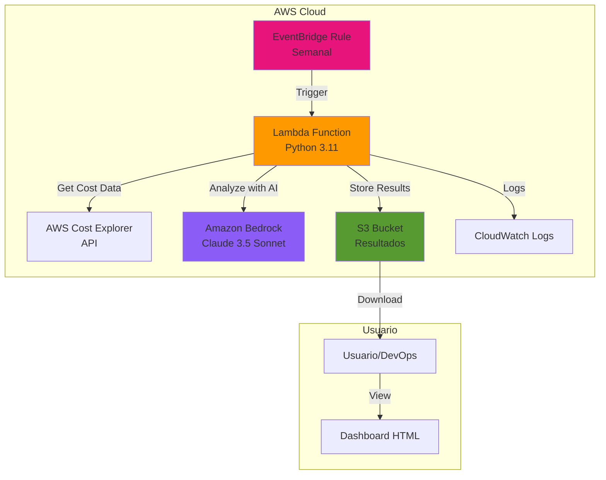
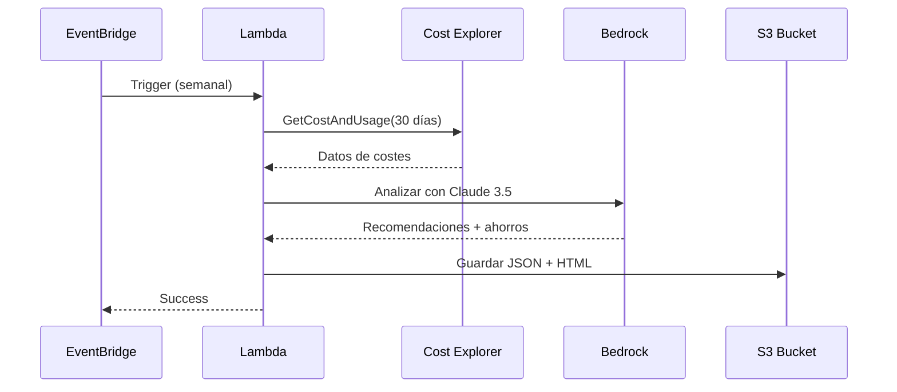

# Arquitectura AWS Cost Optimizer AI

## Diagrama de Arquitectura



## Componentes

### 1. EventBridge Rule
- **Propósito**: Programar ejecución automática semanal
- **Configuración**: Lunes 9:00 AM UTC (configurable)
- **Alternativa**: Invocación manual vía AWS CLI/Console

### 2. Lambda Function
- **Runtime**: Python 3.11
- **Memoria**: 512 MB
- **Timeout**: 5 minutos
- **Funciones**:
  - Obtener datos de Cost Explorer
  - Invocar Bedrock para análisis
  - Guardar resultados en S3
  - Generar dashboard HTML

### 3. AWS Cost Explorer
- **API**: `GetCostAndUsage`
- **Granularidad**: Mensual
- **Métricas**: UnblendedCost
- **Agrupación**: Por servicio AWS

### 4. Amazon Bedrock
- **Modelo**: Claude 3.5 Sonnet
- **Propósito**: Análisis inteligente de costes
- **Output**: Recomendaciones priorizadas con ahorro estimado

### 5. S3 Bucket
- **Contenido**: 
  - Análisis JSON
  - Informes TXT
  - Dashboard HTML
- **Seguridad**: Cifrado AES-256, versionado habilitado

### 6. CloudWatch Logs
- **Retención**: 7 días (configurable)
- **Uso**: Debugging y auditoría

## Flujo de Datos



## Seguridad

### IAM Policies
- **Lambda Role**: Permisos mínimos necesarios
  - `ce:GetCostAndUsage`
  - `bedrock:InvokeModel`
  - `s3:PutObject`, `s3:GetObject`
  - `logs:CreateLogGroup`, `logs:CreateLogStream`, `logs:PutLogEvents`

### Cifrado
- **En reposo**: S3 con AES-256
- **En tránsito**: TLS 1.2+

### Acceso
- **S3 Bucket**: Privado (no público)
- **Lambda**: VPC opcional para mayor aislamiento

## Costes Estimados

### Infraestructura (mensual)
- **Lambda**: ~$0.20 (4 ejecuciones/mes × 2 min)
- **S3**: ~$0.10 (almacenamiento + requests)
- **Cost Explorer**: $0.01 por request × 4 = $0.04
- **Bedrock**: ~$0.50 (4 invocaciones × Claude 3.5)
- **EventBridge**: Gratis (< 1M eventos)

**Total estimado**: ~$0.84/mes

### Ahorro potencial
Basado en análisis de ejemplo: **$687.50/mes**

**ROI**: 81,800% 🚀

## Escalabilidad

### Multi-cuenta
Para analizar múltiples cuentas AWS:
1. Usar AWS Organizations
2. Configurar Cross-Account IAM Roles
3. Iterar sobre cuentas en Lambda

### Multi-región
Para análisis por región:
1. Modificar query de Cost Explorer
2. Agrupar por `REGION` dimension

### Alertas
Añadir SNS para notificaciones:
```python
if total_savings > threshold:
    sns.publish(
        TopicArn='arn:aws:sns:...',
        Subject='Ahorro potencial detectado',
        Message=f'${total_savings}/mes'
    )
```

## Despliegue

### Opción 1: Terraform (recomendado)
```bash
cd terraform
terraform init
terraform plan
terraform apply
```

### Opción 2: AWS SAM
```bash
sam build
sam deploy --guided
```

### Opción 3: Manual
1. Crear S3 bucket
2. Crear IAM role con policies
3. Crear Lambda function
4. Configurar EventBridge rule

## Monitoreo

### CloudWatch Metrics
- Duración de Lambda
- Errores de Lambda
- Invocaciones de Bedrock

### CloudWatch Alarms
- Lambda errors > 0
- Lambda duration > 4 min
- Bedrock throttling

### Dashboard CloudWatch
```json
{
  "widgets": [
    {
      "type": "metric",
      "properties": {
        "metrics": [
          ["AWS/Lambda", "Invocations", {"stat": "Sum"}],
          [".", "Errors", {"stat": "Sum"}],
          [".", "Duration", {"stat": "Average"}]
        ],
        "period": 300,
        "stat": "Average",
        "region": "us-east-1",
        "title": "Cost Optimizer Metrics"
      }
    }
  ]
}
```

## Troubleshooting

### Error: "Access Denied" en Cost Explorer
- Verificar IAM policy tiene `ce:GetCostAndUsage`
- Verificar Cost Explorer está habilitado en la cuenta

### Error: "Model not found" en Bedrock
- Verificar modelo está disponible en la región
- Solicitar acceso al modelo en Bedrock console

### Lambda timeout
- Aumentar timeout a 5 minutos
- Optimizar queries de Cost Explorer
- Reducir días de análisis

## Mejoras Futuras

1. **Aplicación automática de cambios**
   - Integrar con Terraform/CloudFormation
   - Aprobar cambios vía SNS + Lambda

2. **Análisis predictivo**
   - Usar ML para predecir costes futuros
   - Alertas proactivas

3. **Dashboard web**
   - Desplegar en S3 + CloudFront
   - Autenticación con Cognito

4. **Integración Slack/Teams**
   - Notificaciones automáticas
   - Comandos interactivos

## Referencias

- [AWS Cost Explorer API](https://docs.aws.amazon.com/cost-management/latest/APIReference/API_GetCostAndUsage.html)
- [Amazon Bedrock](https://docs.aws.amazon.com/bedrock/)
- [AWS Lambda Best Practices](https://docs.aws.amazon.com/lambda/latest/dg/best-practices.html)
- [Terraform AWS Provider](https://registry.terraform.io/providers/hashicorp/aws/latest/docs)
